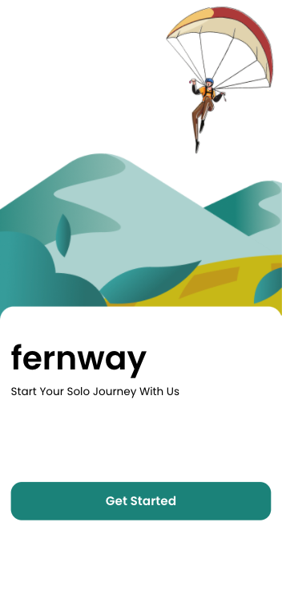
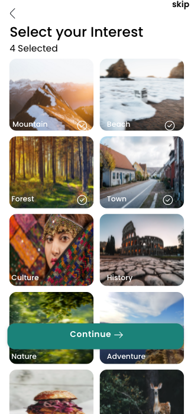
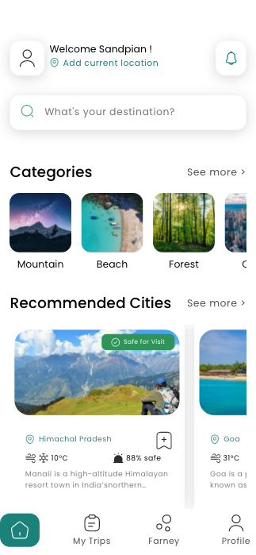
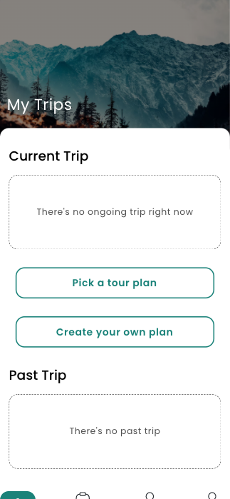
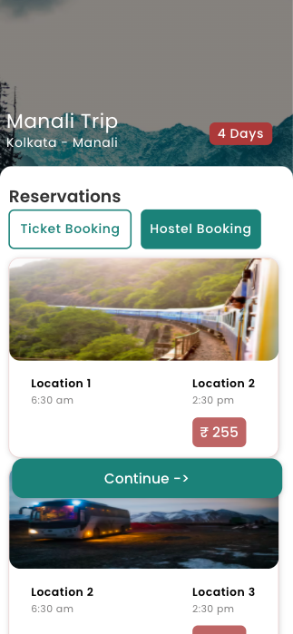
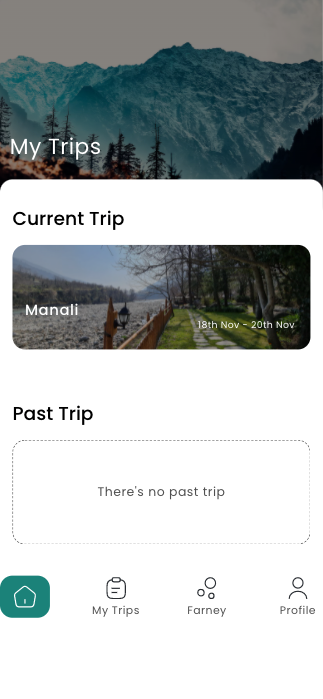
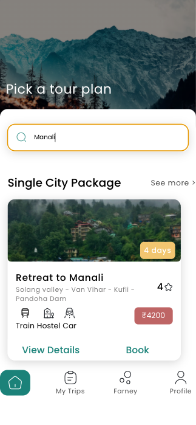

# Fernway Travel

## Description:

This website's objective is to help user to give an easy way to plan trips or to suggest trips based on their interest

## Technologies Used:

- React
- JSON Server

## Packages Used:

- React Router
- axios

## How to Use:

- Clone the app
- Install json-server either globally or locally
- Do `npm i` to install the necessary packages
- Do `npm start` the app will run on port 3000 and also cd into src and do `json-server --watch db.json --port 3004 to get data for the components

## Authors Information:

- Madanakrishnan https://github.com/girishv694
- kapila Mucchinthala https://github.com/kapila-mucchinthala
- Shihab Shaikh https://github.com/shihab-fw11-297
- Shaista Sulthana https://github.com/shaista78
- Rahul Kharche https://github.com/RahulK2699

## App Images

